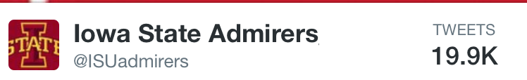
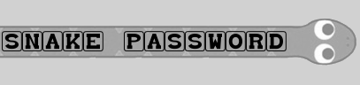

<link rel="stylesheet" type="text/css" href="lib/css/bootswatch.css">
<link rel="stylesheet" type="text/css" href="lib/css/clickthisnick.css">
<link rel="stylesheet" type="text/css" href="lib/css/font-awesome.min.css">
<link rel="stylesheet" type="text/css" href="lib/css/github-ribbon.css">
<link href='http://fonts.googleapis.com/css?family=Arvo' rel='stylesheet' type='text/css'>

### Projects

<html>
<body>
  

  <!-- Projects -->
  

    

      

        <h1 class="text-center title">I Create Software Solutions To Solve Real World Problems</h1>
      

    

    

      

        

          

            <a href="https://github.com/clickthisnick/dynamic-release-checklist" target="_blank">Fork me on GitHub</a>
          

        

        <h4>Dynamic Release Checklist</h4>
        
        A release checklist that uses questions to filter out tasks needed to be performed so only relevant tasks are shown. Written in AngularJS and tested with Jamine.
        

      

  

      

        

          

            <a href="https://github.com/clickthisnick/WorkoutTracker" target="_blank">Fork me on GitHub</a>
          

        

        

          <h4>Workout Tracker</h4>
        

        
        Currently a work in progress, workout tracker helps a person record their lifting numbers without the use of paper or pencil. Written in AngularJS, mobile responsive and easy to use.
        

      

    

    

    

      

        

          

            <a href="https://github.com/clickthisnick/CraigLister" target="_blank">Fork me on GitHub</a>
          

        

        <h4>CraigLister</h4>
        
        Python script using Selenium to navigate the UI and post items on craigslist every 3 days. Uses the Gmail Python library to accept Terms and Conditions, fully automating the posting of CraigList ads.
        

      

  

      

        

          

            <a href="https://github.com/clickthisnick/itinerary" target="_blank">Fork me on GitHub</a>
          

        

        

          <h4>Intinerary</h4>
        

        
        An intinerary creator. Never be late to an event and never forget something again! Written in KnockoutJS
        

      

    

    

    

      

       

        <h4>ISU Admirers</h4>
      

      
      Twitter account amassing 20k followers. Users can submit tweets anonymously to the twitter account via a website I built. Tweets submitted with the LAMP stack and parsed/posted to the Twitter API with Python.
      

    

  

    

      

        <h4>Snake Password</h4>
      

      
      JavaScript password generator. Builds pseudo-random passwords where the next character in the password is next to the previous character.
      

    

  

</body>
</html>

<!-- Projects -->
